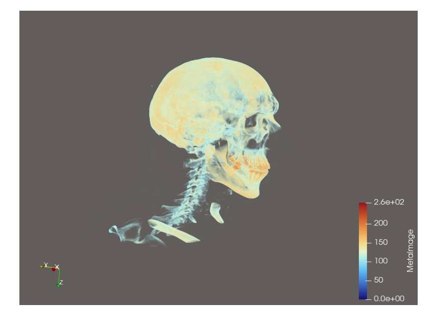
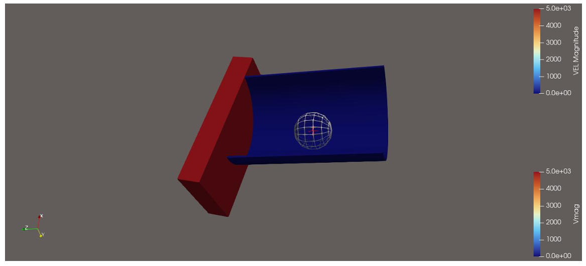
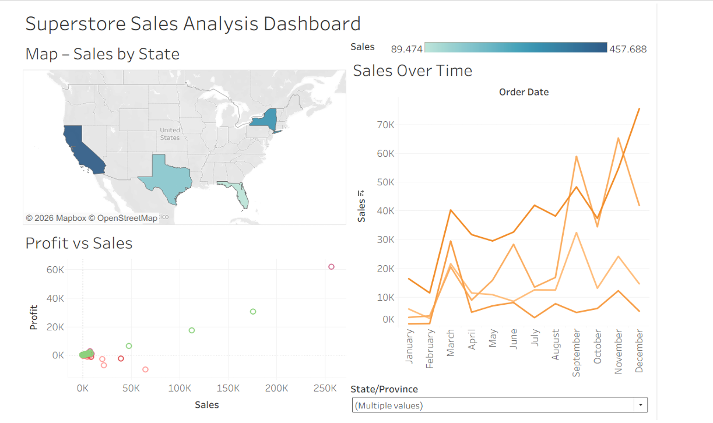
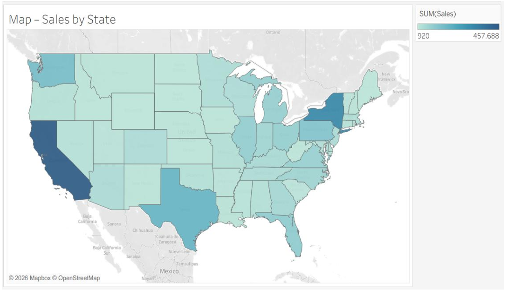
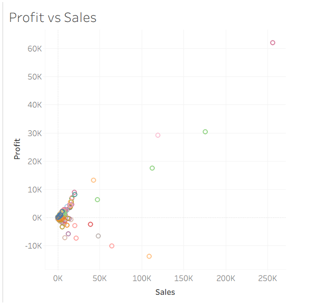

# Visual Data Analytics Project

## Project Overview

This project demonstrates practical applications of data visualization techniques using both scientific and business datasets. The goal is to explore how different visualization methods can be applied depending on the type of data to extract meaningful insights.

The work combines **3D scientific visualization using ParaView** with **interactive data analysis using Tableau**.

---

## Tools & Technologies

* ParaView (scientific visualization)
* Tableau (data analytics & dashboards)

---

## 1. Scientific Visualization (ParaView)

Different types of datasets were visualized using appropriate techniques:

### Volume Rendering (VisHuman Head)

A 3D scalar dataset was visualized using direct volume rendering. Transfer functions were applied to highlight internal anatomical structures by mapping intensity values to color and opacity.

---

### Vector Field Visualization (Flow Analysis)

A 3D vector field dataset was visualized using streamlines and color mapping to represent velocity magnitude. This helps analyze flow behavior and identify high and low velocity regions.

---

### Surface Mesh Visualization

A polygonal dataset (Asian Dragon) was rendered to highlight geometric features using surface-based visualization techniques.

### Molecular Visualization

Protein structures (.pdb files) were explored and compared between ParaView and specialized molecular visualization tools.

---

## 2. Business Data Analysis (Tableau)

An exploratory data analysis was performed on the Superstore dataset using an interactive dashboard.

### Tableau Dashboard

The dashboard integrates multiple visualizations to provide insights into sales and profit performance across different states and over time.

---

## Key Visualizations

### Sales by State (Map)

This map shows the geographic distribution of total sales across U.S. states, highlighting high-performing regions.

---

### Profit vs Sales (Scatter Plot)

This scatter plot illustrates the relationship between sales and profit, helping identify trends, inefficiencies, and outliers.

---

## Key Insights

* States such as **California, New York, and Texas** generate the highest sales.
* There is a **positive but non-linear relationship** between sales and profit.
* Some states show **high sales but low or negative profit**, indicating inefficiencies.
* **Florida demonstrates moderate sales but relatively lower profit margins** compared to other major states.

---

visual-data-analytics-project/
│
├── README.md
├── images/
│   ├── paraview-head.png
│   ├── vector-field.png
│   ├── tableau-dashboard.png
│   ├── sales-map.png
│   └── profit-vs-sales.png
└── report.pdf

## Conclusion

This project demonstrates how different visualization techniques can be applied to both scientific and business data. It highlights the importance of selecting appropriate methods based on data type and shows how dashboards can support data-driven decision-making.

---

## Author

Zunaira Haider
M.Sc. Mathematics in Science and Engineering

